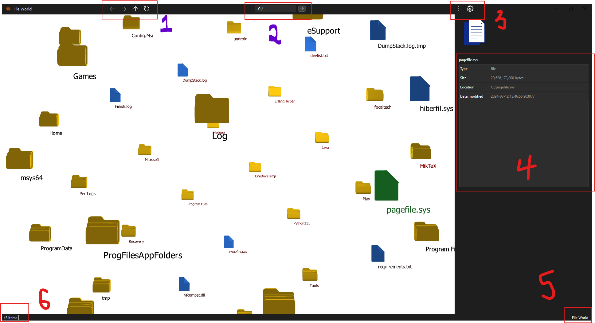

# File World
A file explorer that shows the files per directory in a 3d world. The aim is offer the user a 
more immersive file browsing experience. This design holds no practical value.

Read Everything below

# Platforms
- Windows.
- No distribution ready, download source code and build

# Installation
1. Download the installation file from <a href="release/setup.exe" download>here</a> (click to download)
2. Run it as administrator and follow installation steps
3. You are free to use

# Usage
THIS HAS NOT BEEN THOROUGHLY TESTED, THERE ARE BUGS🐜🐞🪲

## Application Description



1. The navigation bar. Goes back and forth in the history and also refreshes the current view(path) of the scene
2. path search input. jumps to the path that has been set. typing the path and pressing enter works fine. same with
    same with typing the path and pressing the clicking the arrow.
3. Options do not work... 😅 sorry.
4. shows the properties of a highlighted directory.
5. the name of the application
6. the number of items in the current directory

## World Navigation

- right mouse button on an entity to get its properties in the right side panel (item 4 above). highlighted entities are green
- left mouse button on entity to either (i) open it, in case of a file or (ii) go one step deeper into the directory
- hold right mouse button and move the to translate the world in the moved direction
- hold left mouse button and move to rotate the world.
- escape button to bring the whole wold into view.
- arrow keys for translational motion around the world


## Tips and Short-comings
- The application starts with the base directory, in this case drive C. to jump to another drive you would have to enter
  the drive path in the nav bar and press enter. e.g (E:/). This version does not have the drive listings
- When a folder is opened, the panel on the right, shows the properties of the opened path.
- if you cannot see anything when a folder is opened, check the bottom left corner of the window if there are any items 
  in the directory. pressing escape on your keyboard will bring all the items in the directory into focus
- Access maybe denied from reading certain directories if the application is not run as administrator, hence you cannot 
    some directories maybe inaccessible. another side effect is that the file/folder sizes may not be true.
- When a particular folder is highlighted, it starts computing the size to show in the side panel. the larger the 
  directory the longer the computation will take. there is no size caching, so there a bit of a lag in  the properties 
  rendering


# For Devs
Instructions below assume knowledge of python and virtual environments


## Running locally
- clone repo
- install python
- create and activate virtual environment (not required)
- install requirements
```cmd
pip install -r requirements.txt
```

- to run app
```cmd
python app.py
```

- to compile application into dist/ and build/
```cmd
pyinstaller app.spec
```